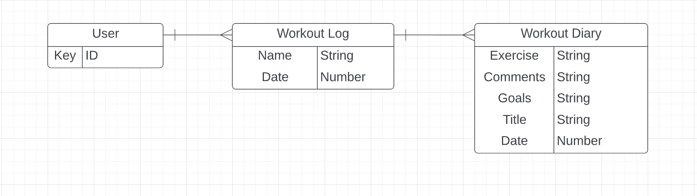
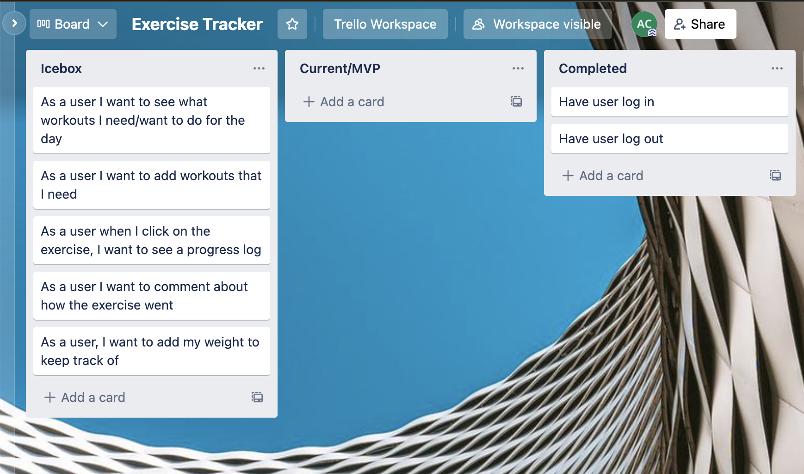
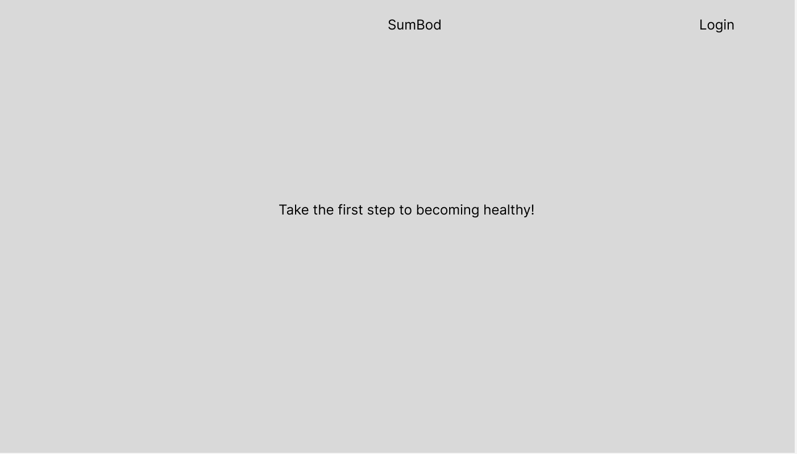
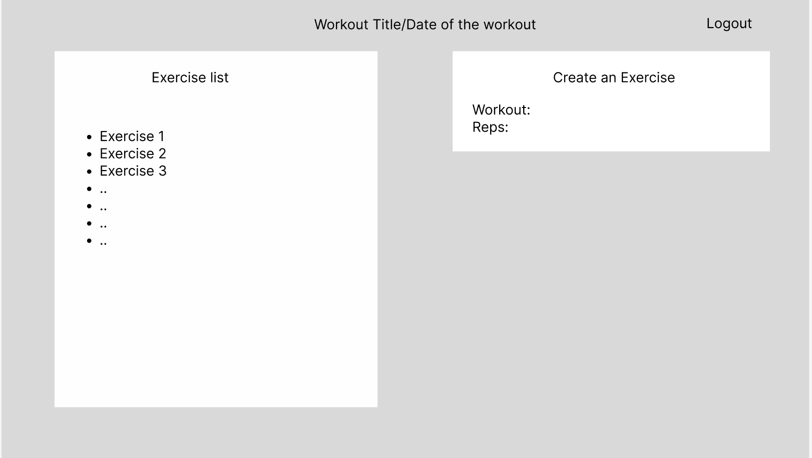
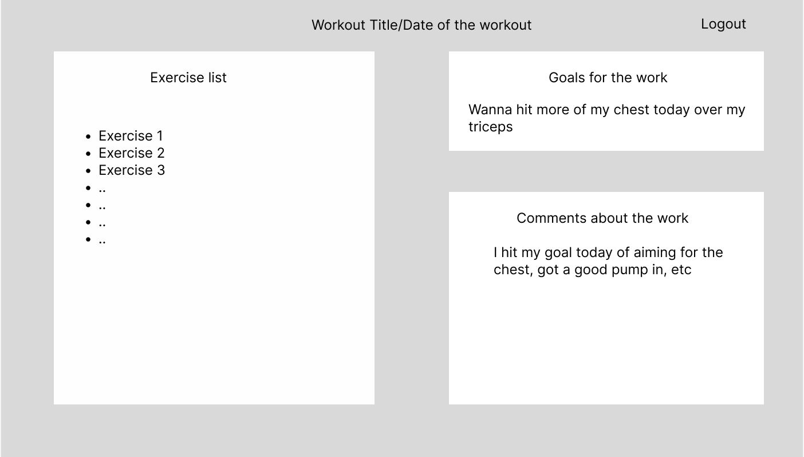

# Exercise Tracker

### Purpose: Keeping track of your exercise to know what you need/want to workout on

### Getting Started:

### LINK:

### Screenshots:

### [ERD] (https://lucid.app/lucidchart/aea93f5d-99c2-4647-aa18-285262b172de/edit?viewport_loc=119%2C-54%2C1579%2C752%2C0_0&invitationId=inv_a0b51f73-a744-4dbf-bbad-bcff50593fc1#)

### [TRELLO BOARD] (https://trello.com/b/LiwJCxPh/exercise-tracker)

### [WIREFRAME] (https://www.figma.com/file/Np16NcmnRl4ZWcgpoM4BXb/Project-3-WireFrame?node-id=2%3A64)

## USED TECHNOLOGIES:

## ICEBOX: 

